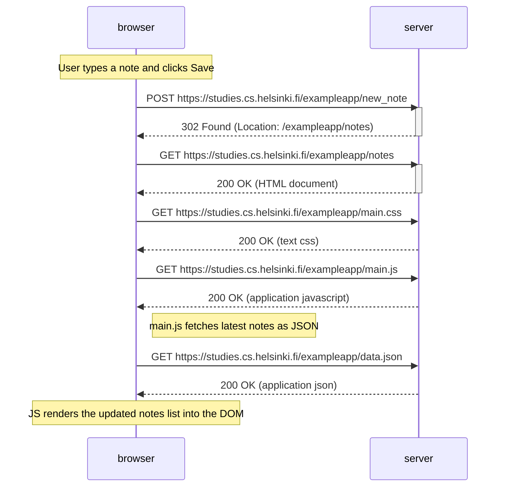
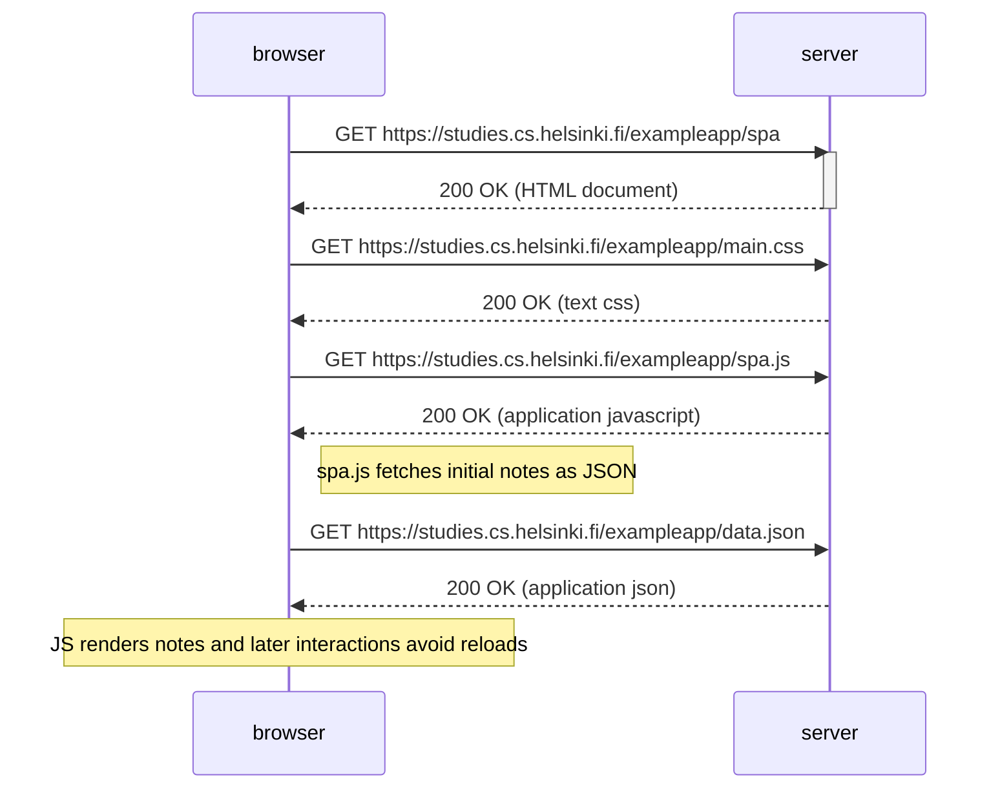
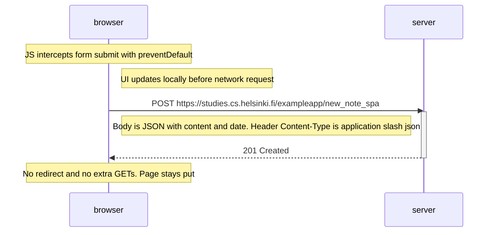

# Part 0 — Diagrams (0.4–0.6)

## 0.4 — Creating a new note on the traditional Notes page

```mermaid
sequenceDiagram
    participant browser
    participant server

    Note over browser: User types a note and clicks Save
    browser->>server: POST https://studies.cs.helsinki.fi/exampleapp/new_note
    activate server
    server-->>browser: 302 Found (Location: /exampleapp/notes)
    deactivate server

    browser->>server: GET https://studies.cs.helsinki.fi/exampleapp/notes
    activate server
    server-->>browser: 200 OK (HTML document)
    deactivate server

    browser->>server: GET https://studies.cs.helsinki.fi/exampleapp/main.css
    server-->>browser: 200 OK (text css)

    browser->>server: GET https://studies.cs.helsinki.fi/exampleapp/main.js
    server-->>browser: 200 OK (application javascript)

    Note right of browser: main.js fetches latest notes as JSON
    browser->>server: GET https://studies.cs.helsinki.fi/exampleapp/data.json
    server-->>browser: 200 OK (application json)

    Note over browser: JS renders the updated notes list into the DOM
```

## 0.5 — Visiting the SPA page (/spa)

```mermaid
sequenceDiagram
    participant browser
    participant server

    browser->>server: GET https://studies.cs.helsinki.fi/exampleapp/spa
    activate server
    server-->>browser: 200 OK (HTML document)
    deactivate server

    browser->>server: GET https://studies.cs.helsinki.fi/exampleapp/main.css
    server-->>browser: 200 OK (text css)

    browser->>server: GET https://studies.cs.helsinki.fi/exampleapp/spa.js
    server-->>browser: 200 OK (application javascript)

    Note right of browser: spa.js fetches initial notes as JSON
    browser->>server: GET https://studies.cs.helsinki.fi/exampleapp/data.json
    server-->>browser: 200 OK (application json)

    Note over browser: JS renders notes and later interactions avoid reloads
```

## 0.6 — Creating a new note in the SPA

```mermaid
sequenceDiagram
    participant browser
    participant server

    Note over browser: JS intercepts form submit with preventDefault
    Note right of browser: UI updates locally before network request

    browser->>server: POST https://studies.cs.helsinki.fi/exampleapp/new_note_spa
    activate server
    Note right of browser: Body is JSON with content and date. Header Content-Type is application slash json
    server-->>browser: 201 Created
    deactivate server

    Note over browser: No redirect and no extra GETs. Page stays put
```